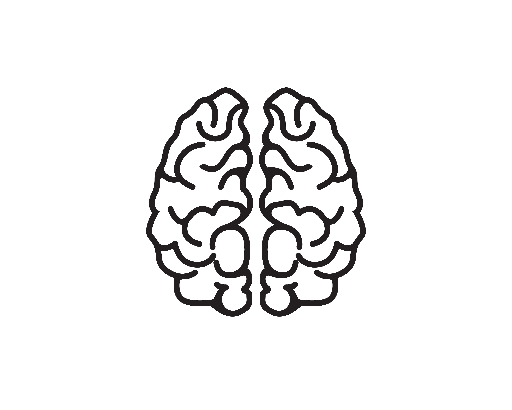
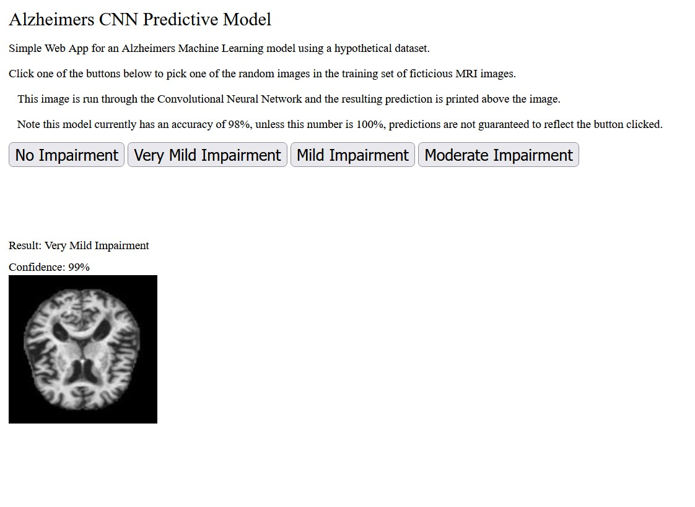

# alz-mri-neural-network

<!-- PROJECT SHIELDS -->
<!--
*** I'm using markdown "reference style" links for readability.
*** Reference links are enclosed in brackets [ ] instead of parentheses ( ).
*** See the bottom of this document for the declaration of the reference variables
*** for contributors-url, forks-url, etc. This is an optional, concise syntax you may use.
*** https://www.markdownguide.org/basic-syntax/#reference-style-links
-->

 

  <a href="https://github.com/jtrull101/alz-mri-neural-network">
    
     
    
      <a href="https://www.vecteezy.com/free-vector/brain">Brain Vectors by Vecteezy</a>
    
  </a>
  
  
  <h3 align="center">Alzheimers MRI Scan Neural Network</h3>

  

    Simple Convolutional Neural Network intended to diagnose fictitious MRI images, labeling new inputs with an estimated Impairment level ranging from No Impairment to Moderate Impairment.
     
    · <a href="https://github.com/othneildrew/Best-README-Template/issues">Report Bug</a>
    · <a href="https://github.com/othneildrew/Best-README-Template/issues">Request Feature</a>
  

  
Table of Contents

  <ol>
    <li>
      <a href="#why-make-this-project">Why Make This Project?</a>
      <ul>
        <li><a href="#built-with">Built With</a></li>
      </ul>
    </li>
    <li>
      <a href="#getting-started">Getting Started</a>
    </li>
    <li><a href="#usage">Usage</a></li>
    <li><a href="#license">License</a></li>
    <li><a href="#contact">Contact</a></li>
  </ol>

## Why Make This Project?

In a deeply personal quest to combat a devastating and pervasive disease, I embarked on a journey to develop a neural network model to read fictitious MRI data and detect the early signs of Alzheimer's disease. This endeavor is motivated by a profound family history that has been haunted by Alzheimer's for generations. The emotional toll of Alzheimer's, coupled with the urgent need for early diagnosis and intervention, fueled my determination to make a difference.

My journey began by delving into the world of medical imaging and artificial intelligence. I gathered fictitious MRI data, sourced from [kaggle.com](https://www.kaggle.com/datasets/lukechugh/best-alzheimer-mri-dataset-99-accuracy), which mirrors the complexities of real-world medical images, to construct a neural network model. This model has been meticulously trained to analyze subtle patterns and anomalies within the brain, with a specific focus on identifying the early indicators of Alzheimer's disease.

My hope is that this project will serve as a beacon of hope for others facing Alzheimer's, a testament to the power of technology, and a tribute to the loved ones who have inspired it. Together, we can shine a light on this dark path and take meaningful steps toward early diagnosis, treatment, and ultimately, a cure for Alzheimer's disease.

(<a href="#readme-top">back to top</a>)

### Built With

Below are the major Python frameworks used for this project

<ul>
  <li>[Tensorflow](https://www.tensorflow.org/)</li>
  <li>[Keras](https://keras.io/)</li>
  <li>[Flask](https://flask.palletsprojects.com/en/3.0.x/)</li>
</ul>
  

(<a href="#readme-top">back to top</a>)

## Getting Started
Installing this software is as simple as the few steps below:

<ol>
  <li>First, pull this git repo to a local directory and cd into that directory</li>
  <li>Next, upgrade pip:
    
    python -m pip install --upgrade pip
  <li>Then pip install the included requirements.txt file</li>

    pip install -r requirements.txt
    
</ol>
  Now you are ready to run tests or the front-end application.

(<a href="#readme-top">back to top</a>)

## Usage

This software utility offers a simple and accessible way to predict Alzheimer's disease progression using MRI data. Here's how to use it:

Starting the Web User Interface (UI):

    ./start_front_end.sh

  Sending MRI Files:
   
  

  To predict Alzheimer's disease progression, send MRI image files to the http://127.0.0.1:5000/predict endpoint of the Flask server. Note these MRI files should be one of the fictitious MRIs present in the data/test/ directory. This model has zero ability to predict actual MRI images.
  

  Interpreting Predictions:
   
  

  The utility will return a prediction for the diagnosis, categorizing it into one of four levels of impairment:
  

  <ul>
    <li>No Impairment</li>  
    <li>Very Mild Impairment</li>
    <li>Mild Impairment</li>  
    <li>Moderate Impairment</li>  
  </ul>
  
   
  Using the Web UI:
   
  

  Accessing the Web Interface:
        Open your web browser and navigate to http://127.0.0.1:5000. This will take you to a basic Graphical User Interface (GUI).
  

   
  Selecting Impairment Categories:
   
  

  On the web UI, you will find four buttons, each corresponding to a different level of impairment. By clicking on one of these buttons, you can initiate a prediction for that specific impairment category.
  

   
  Testing the Model:
  

  The utility will randomly select an MRI image from the training set for the chosen impairment category and run it through the predictive model.

  This utility provides a convenient and user-friendly way to predict Alzheimer's disease progression, making it accessible to both professionals and non-experts. By following these simple steps, you can quickly assess the likelihood of Alzheimer's disease  in MRI images and gain insights into its progression.
  

(<a href="#readme-top">back to top</a>)

## License

Distributed under the MIT License. See `LICENSE.txt` for more information.

(<a href="#readme-top">back to top</a>)

## Contact

Jonathan Trull - jttrull0@gmail.com

Project Link: [https://github.com/jtrull101/alz-mri-neural-network](https://github.com/jtrull101/alz-mri-neural-network)

[![LinkedIn][linkedin-shield]][linkedin-url]

(<a href="#readme-top">back to top</a>)

<!-- MARKDOWN LINKS & IMAGES -->
<!-- https://www.markdownguide.org/basic-syntax/#reference-style-links -->
[linkedin-shield]: https://img.shields.io/badge/-LinkedIn-black.svg?style=for-the-badge&logo=linkedin&colorB=555
[linkedin-url]: https://linkedin.com/in/jonathan--trull

